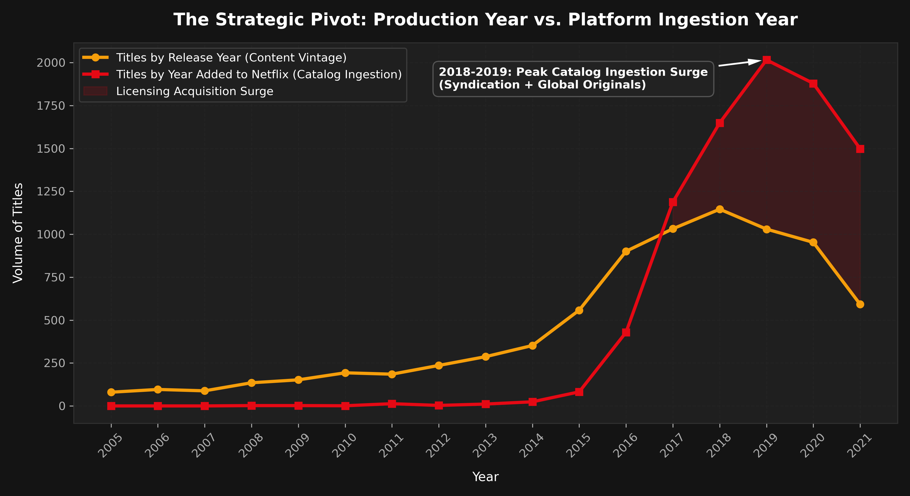
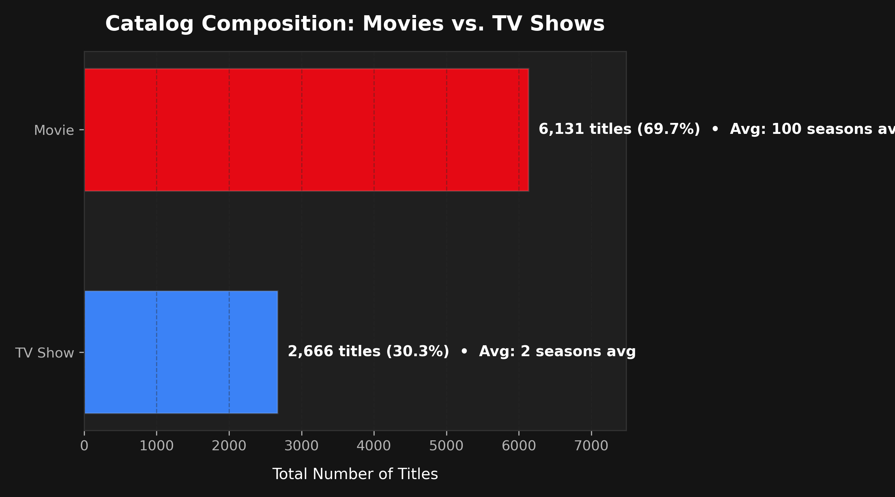
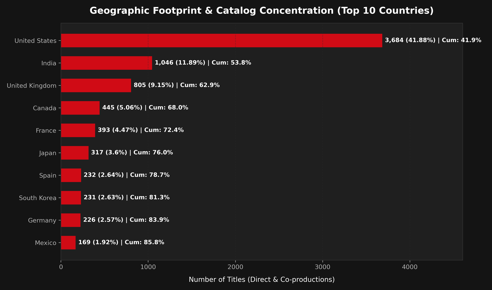
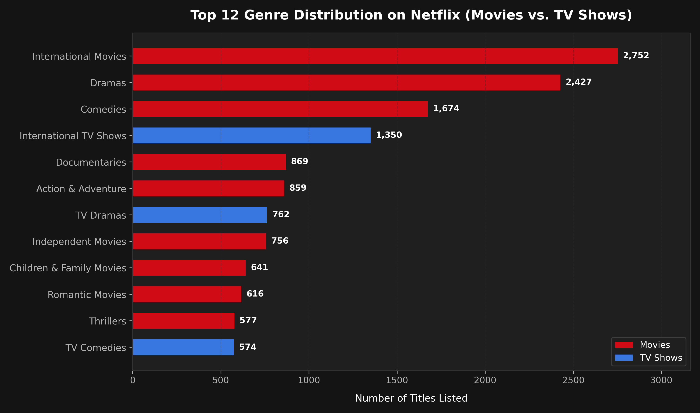

# Netflix Global Content Library — SQL Exploratory Data Analysis

[](https://www.python.org/)
[](https://www.sqlite.org/)
[](LICENSE)
[](https://www.kaggle.com/datasets/shivamb/netflix-shows)

A production-grade, SQL-driven exploratory data analysis of Netflix's global content catalog (8,807 titles). All analytical queries, multi-table joins, and aggregations are implemented in **pure SQL** against an 1NF-normalized SQLite database, backed by clean visualizations and an executive business strategy memo.

---

## Headline Business Insights

1. **The Retention Pivot:** While Movies represent **69.7%** of cumulative catalog volume, TV Shows expanded their share of annual additions from **25.0% in 2018 to 33.7% in 2021**. Episodic series serve as Netflix's strategic engine to curb monthly churn and maximize subscriber lifetime value.
2. **Supply Chain Concentration Vulnerability:** Content production is heavily concentrated in a small handful of hubs: the **Top 3 countries (US, India, UK) produce 62.9%** of all catalog titles, and the Top 10 control **85.8%**, exposing Netflix to regional licensing and geopolitical supply risks.
3. **Adult Demographic Moat vs. Family Gap:** **61.0%** of titles are rated for mature audiences (TV-MA: 36.4%, TV-14: 24.5%). While this solidifies Netflix's reputation in prestige adult entertainment, strictly kids/family programming accounts for under 15%, leaving an opening for competitors like Disney+.

---

## Key Visualizations

<p align="center">
  
</p>

*Figure 1: The Strategic Pivot — Comparison between production release year (content vintage) and Netflix platform addition year, illustrating the dramatic shift from licensing legacy catalogs to direct-to-consumer originals.*

<p align="center">
  
</p>

*Figure 2: Catalog Composition — Macro volume split between feature films (avg. 100 min runtime) and multi-season episodic television (avg. 1.8 seasons).*

<p align="center">
  
</p>

*Figure 3: Geographic Footprint — Direct catalog shares and cumulative production concentration across the top 10 producer countries.*

<p align="center">
  
</p>

*Figure 4: Top Genres Breakdown — Cross-format thematic distribution highlighting the dominance of International dramas, comedies, and documentaries.*

---

## Architecture & Methodology

### 1. Data Cleaning & 1NF Normalization (`src/clean_data.py`)
- **Missing Value Imputation:** `director` (~30% null), `cast`, and `country` filled with `"Unknown"` to avoid discarding ~35% of catalog records.
- **Rating Shift Anomaly Resolution:** Fixed a known source-data shift error where duration strings (e.g. `"74 min"`) leaked into the `rating` column; duration values were restored to `duration` and rating was set to `"Unknown"`.
- **Duration Decomposition:** Split into `duration_value` (integer) and `duration_unit` (`"min"` for films, `"Season(s)"` for TV series) to allow mathematical aggregations.
- **1NF Relational Decomposition:** Multi-valued comma-separated fields (`listed_in`, `country`) were exploded into dedicated junction tables:
  - `genre_map (show_id TEXT, genre TEXT)`
  - `country_map (show_id TEXT, country TEXT)`
- **Indexing:** Created composite B-tree indexes on foreign keys and filtering columns (`type`, `rating`, `date_added`, `release_year`, `genre`, `country`).

### 2. SQL Analytics Suite (`sql/`)
All EDA is conducted via explicit `.sql` script files:
- [`01_schema.sql`](sql/01_schema.sql): DDL definitions and indexing.
- [`02_content_distribution.sql`](sql/02_content_distribution.sql): Movies vs TV Shows split and runtime averages.
- [`03_genre_mix.sql`](sql/03_genre_mix.sql): Multi-table join aggregation for top 20 genres by content format.
- [`04_ratings.sql`](sql/04_ratings.sql): Demographic maturity bracket segmentation.
- [`05_release_trends.sql`](sql/05_release_trends.sql): Production vintage vs platform ingestion time-series.
- [`06_country_production.sql`](sql/06_country_production.sql): Top producing territories, windowed cumulative concentration, and regional genre specialization.
- [`07_release_cadence.sql`](sql/07_release_cadence.sql): Month-over-month velocity and calendar seasonality.

---

## Project Structure

```
netflixAnalysis/
├── .gitignore                          # Git exclusions (DBs, caches, checkpoints)
├── README.md                           # Project summary and documentation
├── requirements.txt                    # Project dependencies
├── data/
│   ├── raw/
│   │   └── netflix_titles.csv          # Raw Kaggle dataset (8,807 rows)
│   └── processed/
│       └── netflix.db                  # Cleaned SQLite relational database
├── notebooks/
│   └── eda_analysis.ipynb              # Fully executed interactive walkthrough notebook
├── sql/
│   ├── 01_schema.sql                   # Relational DDL & index definitions
│   ├── 02_content_distribution.sql     # Movies vs TV Shows split & stats
│   ├── 03_genre_mix.sql                # Normalized genre rankings by type
│   ├── 04_ratings.sql                  # Maturity ratings & audience segmentation
│   ├── 05_release_trends.sql           # Vintage vs ingestion velocity analysis
│   ├── 06_country_production.sql       # Geographic concentration & specialization
│   └── 07_release_cadence.sql          # Addition cadence & seasonal patterns
├── src/
│   ├── load_data.py                    # Ingests raw CSV into SQLite
│   ├── clean_data.py                   # Data cleaning and 1NF junction builder
│   └── run_queries.py                  # Executes SQL queries and renders figures
└── outputs/
    ├── figures/                        # 6 high-res analytical figures (300 DPI)
    │   ├── 01_content_distribution.png
    │   ├── 02_top_genres.png
    │   ├── 03_ratings_distribution.png
    │   ├── 04_release_vs_added_trends.png
    │   ├── 05_country_production_concentration.png
    │   └── 06_release_cadence_seasonality.png
    └── insights_summary.md             # Executive strategic briefing memo
```

---

## Reproduction Guide

### Prerequisites
- Python 3.10+ (compatible with active Conda `base` environment)
- Core libraries: `pandas`, `matplotlib`, `seaborn`, `kagglehub`, `jupyter`

```bash
# 1. Clone repository
git clone https://github.com/Manthan-Sagar/NetflixDataAnalysis.git
cd NetflixDataAnalysis

# 2. Install dependencies (if not already in your base environment)
pip install -r requirements.txt

# 3. Ingest raw CSV to SQLite
python src/load_data.py

# 4. Clean data, resolve anomalies, and construct 1NF junction tables
python src/clean_data.py

# 5. Execute analytical SQL queries and generate publication charts
python src/run_queries.py

# 6. Launch narrative Jupyter Notebook
jupyter notebook notebooks/eda_analysis.ipynb
```

---

## Dataset Citation
- Source: [Kaggle — Netflix Movies and TV Shows](https://www.kaggle.com/datasets/shivamb/netflix-shows) by Shivam Bansal.
- Scope: 8,807 titles cataloged across 12 raw attributes.
